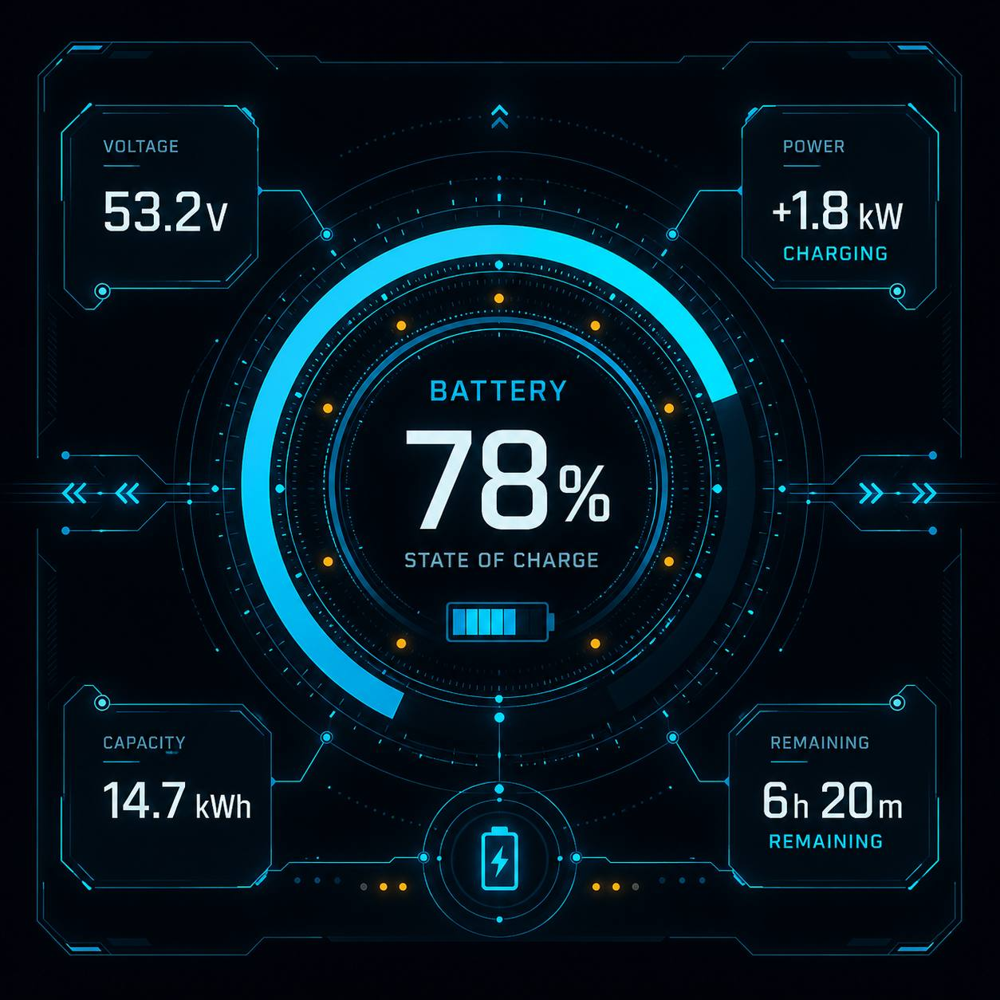
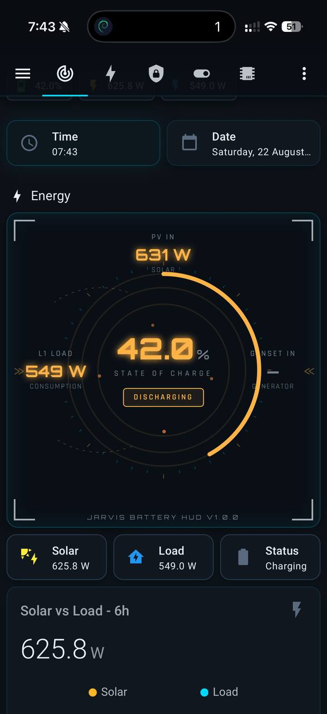

# Jarvis Battery HUD

A Home Assistant Lovelace card that renders a **futuristic HUD-style battery State of Charge gauge** with three corner stat tiles — designed to match the Jarvis Interface aesthetic (cyan `#00D9FF`, Orbitron, Rajdhani, glassmorphic, dark).


## What it does

- **Center ring** — animated multi-arc SVG gauge showing SoC % with tick marks, glowing dot pulses, and a charging / discharging / idle badge
- **Top corner** — PV In (W) — total of all MPPT chargers
- **Left corner** — L1 Load (W) — current house consumption
- **Right corner** — Genset In (W) — generator output (auto-handles unavailable gracefully)
- **SoC-reactive color** — cyan >50%, amber 20–50%, red <20%
- **Three size presets** — `small` (240×240), `medium` (320×320, default), `large` (400×400)

## Installation

### HACS (recommended)

1. Add this repository as a **Custom Repository** in HACS: `https://github.com/28labsnz/jarvis-battery-hud`, category **Lovelace**
2. Install **Jarvis Battery HUD**
3. Restart Home Assistant

### Manual

1. Copy `jarvis-battery-hud.js` into `/config/www/community/jarvis-battery-hud/`
2. Add as a Lovelace resource (Settings → Dashboards → Resources → Add Resource):
   - URL: `/local/community/jarvis-battery-hud/jarvis-battery-hud.js`
   - Type: JavaScript Module
3. Refresh your browser

## Configuration

```yaml
type: custom:jarvis-battery-hud
card_size: medium                  # small | medium | large
entity_soc: sensor.gx_device_dc_battery_charge       # required — % SoC entity
entity_pv_in: sensor.jarvis_total_pv_power           # optional — W
entity_load: sensor.gx_device_consumption_power_l1   # optional — W
entity_genset: sensor.gx_device_genset_load_l1       # optional — W (handles unavailable)
entity_state: sensor.gx_device_dc_battery_state      # optional — explicit state string
charging_is_positive: false                          # sign convention of dc_battery_power
title: STATE OF CHARGE                               # center label
show_pv: true
show_load: true
show_genset: true
```

### Required template sensors

The card doesn't sum MPPT chargers or convert Ah → kWh — it expects flat W and W-ready values. Add these to `configuration.yaml` under `template:`:

```yaml
template:
  - sensor:
      - name: "Jarvis Total PV Power"
        unique_id: "sensor_jarvis_total_pv_power"
        unit_of_measurement: "W"
        device_class: power
        state_class: measurement
        state: >
          {{ (states('sensor.mppt_1_pv_yield_power') | float(0)
              + states('sensor.mppt_2_id_1_pv_yield_power') | float(0)) | round(1) }}
```

## Color buckets

| SoC | Color | Hex |
|-----|-------|-----|
| > 50% | Cyan | `#00D9FF` |
| 20–50% | Amber | `#FFB347` |
| < 20% | Red | `#FF4D6D` |

The ring fill, the SoC percentage, the corner panel values, and the corner brackets all shift color together.


## Design

The card was designed to match the [Jarvis Interface](https://github.com/28labsnz/ratchet) aesthetic. Design inspiration vs. live render:

| Design mockup | Live render |
|:---:|:---:|
|  |  |

### Color buckets

| SoC | Color | Hex |
|-----|-------|-----|
| > 50% | Cyan | `#00D9FF` |
| 20–50% | Amber | `#FFB347` |
| < 20% | Red | `#FF4D6D` |

## License

MIT — see [LICENSE](LICENSE).